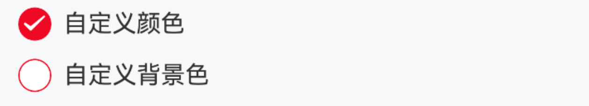

# Checkbox 复选框

## 介绍

在一组备选项中进行多选。

## 引入

```ts
import { IBestCheckbox, IBestCheckboxGroup } from "@ibestservices/ibest-ui";
```

## 代码演示

::: tip

- 通过 `IBestCheckboxGroup` 的 `onChange` 事件获取当前选中的 `IBestCheckbox` 的 `name` 。
- 通过 `group` 属性将 `IBestCheckboxGroup` 与 `IBestCheckbox` 组件关联起来， `group` 的值具有**全局唯一性**或已入栈的页面**唯一性**，与 `IBestRadio` 组件的 `group` 值不冲突。
- 通过 `IBestCheckbox` 组件的 `value` 来设置默认选中。
- `IBestCheckbox` 组件的 `name` 值在同一 `group` 中需具备**唯一性**。

:::

### 基础用法


::: tip

- 通过 `IBestCheckbox` 的 `onChange` 事件来响应选中状态的变化。
- 通过 `IBestCheckbox` 组件的 `value` 来设置默认选中。

:::

::: details 点我查看代码

```ts
IBestCheckbox({
  value: true,
  label: "复选框",
  name: "checkbox1",
  onChange: value => {
    console.log("checkbox1", value);
  },
});
```

:::

### 禁用状态


::: tip

通过设置 `disabled` 属性可以禁用复选框。

:::

::: details 点我查看代码

```ts
IBestCheckbox({
  value: true,
  disabled: true,
  label: "复选框",
  name: "checkbox2",
});
IBestCheckbox({
  value: false,
  disabled: true,
  label: "复选框",
  name: "checkbox3",
});
```

:::

### 自定义形状


::: tip

将 `shape` 属性设置为 `square`，复选框的形状会变成方形。

:::

::: details 点我查看代码

```ts
IBestCheckbox({
  value: true,
  shape: "square",
  label: "自定义形状a",
  name: "checkbox4",
});

IBestCheckbox({
  value: false,
  shape: "square",
  label: "自定义形状b",
  name: "checkbox5",
});
```

:::

### 自定义颜色


::: tip

通过 `checkedColor` 属性设置选中状态的图标颜色。

:::

::: details 点我查看代码

```ts
IBestCheckbox({
  value: true,
  checkedColor: "#ee0a24",
  shape: "square",
  label: "自定义颜色a",
  name: "checkbox5",
});
IBestCheckbox({
  value: true,
  checkedColor: "#ee0a24",
  label: "自定义颜色b",
  name: "checkbox6",
});
```

:::

### 自定义大小


::: tip

通过 `iconSize` 属性可以自定义图标与文字的大小。

:::

::: details 点我查看代码

```ts
IBestCheckbox({
  value: true,
  iconSize: 60,
  label: "自定义大小",
  name: "checkbox7",
});
```

:::

### 左侧文本


::: tip

将 `labelPosition` 属性设置为 `'left'`，可以将文本位置调整到复选框左侧。

:::

::: details 点我查看代码

```ts
IBestCheckbox({
  value: true,
  labelPosition: "left",
  label: "左侧文本",
  name: "checkbox8",
});
```

:::

### 禁用文本点击


::: tip

设置 `labelDisabled` 属性后，点击图标以外的内容不会触发复选框切换。

:::

::: details 点我查看代码

```ts
IBestCheckbox({
  value: true,
  label: "复选框",
  labelDisabled: true,
  name: "checkbox9",
});
```

:::

### 复选框组


::: tip

- 通过 `IBestCheckboxGroup` 的 `onChange` 事件获取当前选中的 `checkbox` 的 `name` 。
- 通过 `IBestCheckbox` 组件的 `value` 来设置默认选中。

:::

::: details 点我查看代码

```ts
IBestCheckboxGroup({
  group: "group1",
  onChange: checkboxNames => {
    console.log(JSON.stringify(checkboxNames));
  },
});
IBestCheckbox({
  value: true,
  group: "group1",
  label: "复选框a",
  name: "checkbox10",
});

IBestCheckbox({
  value: true,
  group: "group1",
  label: "复选框b",
  name: "checkbox11",
});
```

:::

### 水平排列


::: tip

给组件包裹一层 `Row` 组件，复选框组会变成水平排列。

:::

::: details 点我查看代码

```ts
IBestCheckboxGroup({
  group: "group3"
});

Row(){
  IBestCheckbox({
    value: true,
    group: "group3",
    label: "复选框a",
    name: "checkbox10",
  });

  IBestCheckbox({
    value: true,
    group: "group3",
    label: "复选框b",
    name: "checkbox11",
  });
}

```

:::

### 限制最大可选数


::: tip

通过 `max` 属性可以限制复选框组的最大可选数。

:::

::: details 点我查看代码

```ts
IBestCheckboxGroup({
  group: "group2",
  max: 2
});

Row(){
  IBestCheckbox({
    value: true,
    group: "group2",
    label: "复选框a",
    name: "checkbox10",
  });

  IBestCheckbox({
    value: true,
    group: "group2",
    label: "复选框b",
    name: "checkbox11",
  });

  IBestCheckbox({
    value: true,
    group: "group2",
    label: "复选框c",
    name: "checkbox11",
  });
}

```

:::

### 全选与反选


::: tip

通过 `CheckboxGroup` 实例上的 `toggleAll` 方法可以实现全选与反选。

:::

::: details 点我查看代码

```ts
import { IBestCheckboxGroup, IBestCheckbox, CheckboxGroupContext } from '@ibestservices/ibset-ui'

@Entry
@Component
struct CheckboxPage {
  /**
   * 全选反选的chekboxGroup的this指向
   */
  checkboxGroupContext: CheckboxGroupContext | null = null;

  build(){
    Column(){
      IBestCheckboxGroup({
        group: 'group4',
        // 代表子组件和当前组件加载完成
        onReady: (checkboxGroupContext) => {
          this.checkboxGroupContext = checkboxGroupContext
        }
      })

      IBestCheckbox({
        group: 'group4',
        label: '复选框a',
        name: 'checkbox1'
      })

      IBestCheckbox({
        group: 'group4',
        label: '复选框b',
        name: 'checkbox2',
      })

      IBestCheckbox({
        group: 'group4',
        label: '复选框c',
        name: 'checkbox3',
      })

      Row(){
        IBestButton({
          text: '全选',
          type: 'primary',
          onClickBtn: () => {
            this.checkboxGroupContext.toggleAll(true)
          }
        })

        IBestButton({
          text: '反选',
          type: 'warning',
          onClickBtn: () => {
            this.checkboxGroupContext.toggleAll()
          }
        })

        IBestButton({
          text: '取消选中',
          onClickBtn: () => {
            this.checkboxGroupContext.toggleAll(false)
          }
        })
      }
    }
  }
}
```

:::

### 不确定状态


::: tip

通过 `indeterminate` 设置复选框是否为不确定状态。

:::

::: details 点我查看代码

```ts
import { IBestCheckboxGroup, IBestCheckbox, CheckboxGroupContext } from '@ibestservices/ibset-ui'

@Entry
@Component
struct CheckboxPage {
  /**
   * 不确定状态
   */
  @State isIndeterminate: boolean = true;
  /**
   * 不确定状态数据是否选中了全部
   */
  @State isIndeterminateCheckAll: boolean = false;
  /**
   * 全选反选的chekboxGroup的this指向
   */
  checkboxGroupIndeterminateContext: CheckboxGroupContext | null = null;

  build(){
    Column() {
      IBestCheckbox({
        value: this.isIndeterminateCheckAll,
        label: '全选',
        indeterminate: this.isIndeterminate,
        name: 'checkbox10',
        onChange: (checked) => {
          this.checkboxGroupIndeterminateContext?.toggleAll(checked)
        }
      })
    }

    IBestCheckboxGroup({
      group: 'group5',
      onChange: (checkedNames) => {
        const length = checkedNames.length
        this.isIndeterminate = length < 2 && length > 0;
        this.isIndeterminateCheckAll = length === 2
      },
      onReady: (checkboxGroupContext) => {
        this.checkboxGroupIndeterminateContext = checkboxGroupContext
      }
    })

    IBestCheckbox({
      group: 'group5',
      label: '复选框a',
      name: 'checkbox10'
    })

    IBestCheckbox({
      value: true,
      group: 'group5',
      label: '复选框b',
      name: 'checkbox11',
    })

  }
}
```

:::

### 搭配单元格组件使用


::: tip

搭配单元格组件使用时，需要再引入 `IBestCell` 和 `IBestCellGroup` 组件。

:::

::: details 点我查看代码

```ts
import { IBestCheckboxGroup, IBestCheckbox, CheckboxGroupContext } from '@ibestservices/ibset-ui'

@Entry
@Component
struct CheckboxPage {
   /**
   * 搭配单元格组件选中的name
   */
  @State cellCehckedNames: string[] = [];

  /**
   * 最大可选数量
   */
  cellCheckedMaxNum = 2

  @Builder CellCheckbox(name, group){
    IBestCheckbox({
      name,
      group,
      value: this.cellCehckedNames.includes(name)
    })
  }

   handleClickCell(name){
    const index = this.cellCehckedNames.indexOf(name)
    if(index > -1){
      this.cellCehckedNames.splice(index ,1)
    }else{
      (this.cellCheckedMaxNum > this.cellCehckedNames.length) && this.cellCehckedNames.push(name)
    }
  }

  build(){
    Column() {
      IBestCheckboxGroup({
        group: 'group17',
        max: this.cellCheckedMaxNum,
        onChange: (names)=>{
          console.log(JSON.stringify(names))
        }
      })

      IBestCell({
        clickable: true,
        title: '复选框1',
        rightIconBuilder: () => this.CellCheckbox('checkbox1-cell', 'group17'),
        onClickCell: () => this.handleClickCell('checkbox1-cell')
      })

      IBestCell({
        clickable: true,
        title: '复选框2',
        rightIconBuilder: () => this.CellCheckbox('checkbox2-cell', 'group17'),
        onClickCell: () => this.handleClickCell('checkbox2-cell')
      })

      IBestCell({
        clickable: true,
        title: '复选框3',
        hasBorder: false,
        rightIconBuilder: () => this.CellCheckbox('checkbox3-cell', 'group17'),
        onClickCell: () => this.handleClickCell('checkbox3-cell')
      })
    }
  }
}
```

:::

## API

### Checkbox @Props

| 参数          | 说明                                                                      | 类型                 | 默认值  |
| ------------- | ------------------------------------------------------------------------- | -------------------- | ------- |
| name          | 标识符，通常为一个唯一的字符串或数字，同一 `group` 的 `name` 不可重复     | _string_ \| _number_ |         |
| group         | 标识符，通常为一个唯一的字符串，需具备`全局唯一性`或已入栈的页面`唯一性`  | _string_             |         |
| label         | 显示的文本                                                                | _string_             |         |
| value         | 默认是否选中 非双向绑定，如果要更改数据请从 `onChange` 回调中获取最新的值 | _string_             |         |
| iconSize      | 图标大小，单位 `lpx`， `label` 文字会跟着等比例缩放                       | _number_             | `40`    |
| shape         | 形状，可选值为 `square` `dot`                                             | _string_             | `round` |
| disabled      | 是否为禁用状态                                                            | _boolean_            | `false` |
| labelDisabled | 是否禁用文本内容点击                                                      | _boolean_            | `false` |
| labelPosition | 文本位置，可选值为 `left`                                                 | _string_             | `right` |
| checkedColor  | 选中状态颜色                                                              | _string_             |         |
| indeterminate | 是否为不确定状态                                                          | _boolean_            | `false` |

### CheckboxGroup @Props

| 参数  | 说明                                                                     | 类型     | 默认值 |
| ----- | ------------------------------------------------------------------------ | -------- | ------ |
| group | 标识符，通常为一个唯一的字符串，需具备`全局唯一性`或已入栈的页面`唯一性` | _string_ |        |
| max   | 最大可选数，`0` 为无限制                                                 | _number_ |        |

### Checkbox Events

| 事件名   | 说明                   | 事件类型                       |
| -------- | ---------------------- | ------------------------------ |
| onChange | 选中状态改变的回调事件 | (checked: _boolean_) => _void_ |

### CheckboxGroup Events

| 事件名   | 说明                                                                 | 事件类型                                                 |
| -------- | -------------------------------------------------------------------- | -------------------------------------------------------- |
| onChange | 选中状态改变的回调事件，回调参数是选中的 `checkbox` 组件的 `name` 值 | (checkboxNames: _string[]_) => _void_                    |
| onReady  | 初始化完成的回调                                                     | (checkboxGroupContext: _CheckboxGroupContext_) => _void_ |

### Checkbox @BuilderParam 插槽

| 插槽名         | 说明                                                     | 类型                                                         |
| -------------- | -------------------------------------------------------- | ------------------------------------------------------------ |
| defaultBuilder | `label` 的插槽，优先级大于 `label` 属性                  | (data: { checked: _boolean_, disabled: _boolean_ }) => _any_ |
| iconBuilder    | 自定义图标插槽，需要自己调整选中与未选中展示的 `UI` 内容 | (data: { checked: _boolean_, disabled: _boolean_ }) => _any_ |
