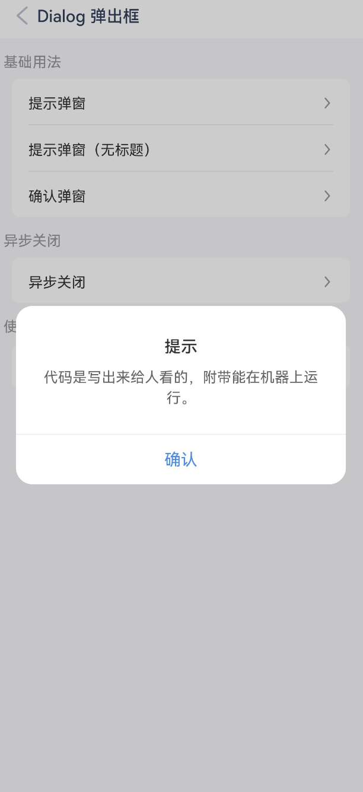
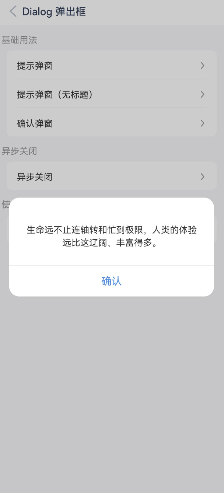
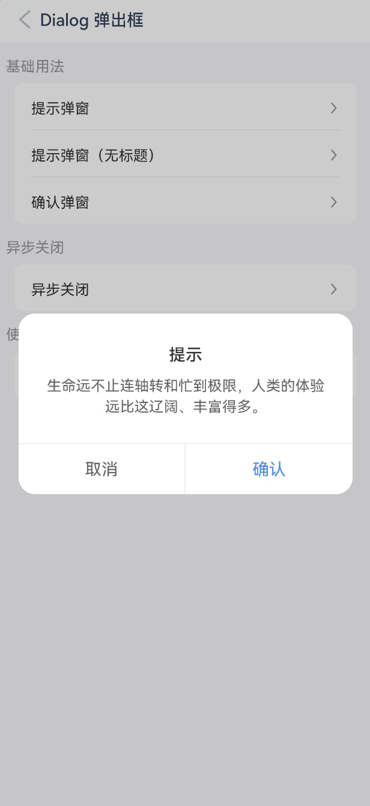
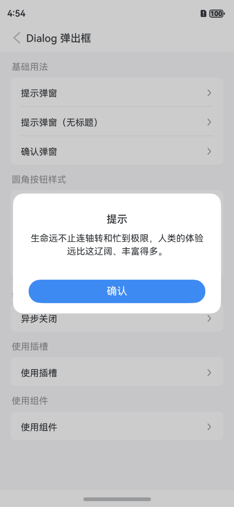
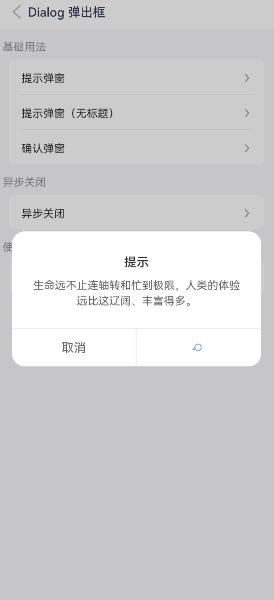
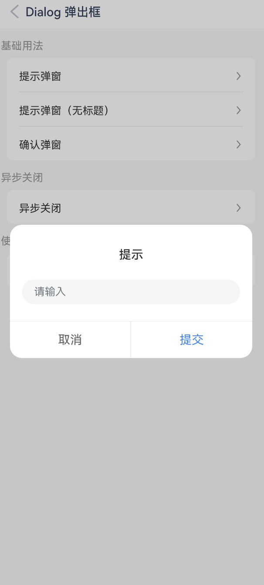
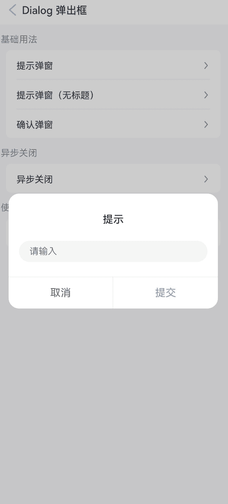

# Dialog 弹出框

## 介绍

弹出模态框，常用于消息提示、消息确认，或在当前页面内完成特定的交互操作。支持组件调用和函数调用两种方式。

## 引入

```ts
import { IBestDialogUtil, IBestDialog } from "@ibestservices/ibest-ui";
```

## 代码演示

### 提示弹窗


::: tip
用于提示一些消息，默认只包含一个确认按钮。
:::

::: details 点我查看代码
```ts
@Entry
@Component
struct DemoPage {
  build(){
    Column(){
      IBestButton({
        text: '打开弹窗',
        type: 'primary',
        onClickBtn: () => {
          IBestDialogUtil.open({
            title: "提示",
            message: "代码是写出来给人看的，附带能在机器上运行。",
            onConfirm: () => {
              console.log("点击确定")
            }
          })
        }
      })
    }
  }
}
```
:::

### 提示弹窗（无标题)



::: details 点我查看代码
```ts
@Entry
@Component
struct DemoPage {
  build(){
    Column(){
      IBestButton({
        text: '打开弹窗',
        type: 'primary',
        onClickBtn: () => {
          IBestDialogUtil.open({
            message: "生命远不止连轴转和忙到极限，人类的体验远比这辽阔、丰富得多。"
          })
        }
      })
    }
  }
}
```
:::

### 确认弹窗



::: details 点我查看代码
```ts
@Entry
@Component
struct DemoPage {
  build(){
    Column(){
      IBestButton({
        text: '打开弹窗',
        type: 'primary',
        onClickBtn: () => {
          IBestDialogUtil.open({
            title: "提示",
            message: "生命远不止连轴转和忙到极限，人类的体验远比这辽阔、丰富得多。",
            showCancelButton: true
          })
        }
      })
    }
  }
}
```
:::

### 圆角按钮样式


:::tip
通过 `theme` 属性设置弹窗主题，可选值为 `default`（默认）、`round-button`（圆角按钮）；   
通过 `buttonSpace` 属性可设置底部按钮间距, 仅 `round-button` 模式有效。
:::

::: details 点我查看代码
```ts
@Entry
@Component
struct DemoPage {
  build(){
    Column(){
      IBestButton({
        text: '圆角按钮样式',
        type: 'primary',
        onClickBtn: () => {
          IBestDialogUtil.open({
            title: "提示",
            message: "生命远不止连轴转和忙到极限，人类的体验远比这辽阔、丰富得多。",
            theme: "round-button"
          })
        }
      })
    }
  }
}
```
:::

### 异步关闭


::: tip
通过 `beforeClose` 属性可以传入一个回调函数，在弹窗关闭前进行特定操作。
:::

::: details 点我查看代码
```ts
@Entry
@Component
struct DemoPage {
  build(){
    Column(){
      IBestButton({
        text: '打开弹窗',
        type: 'primary',
        onClickBtn: () => {
          IBestDialogUtil.open({
            title: textData.title,
            message: textData.life,
            showCancelButton: true,
            beforeClose: (action) => {
              if(action == "confirm"){
                return new Promise(resolve => {
                  IBestDialogUtil.open({
                    title: "提示",
                    message: "确认关闭？",
                    showCancelButton: true,
                    onConfirm: () => {
                      resolve(true)
                    },
                    onCancel: () => {
                      resolve(false)
                    }
                  })
                })
              }
              return true
            }
          })
        }
      })
    }
  }
}
```
:::

### 使用插槽



::: details 点我查看代码
```ts
@Entry
@Component
struct DemoPage {
  @Builder customComponentContent() {
    Column(){
      Text("如果解决方法是丑陋的，那就肯定还有更好的解决方法，只是还没有发现而已。")
    }
    .padding(20)
  }
  build(){
    Column(){
      IBestButton({
        text: '打开弹窗',
        type: 'primary',
        onClickBtn: () => {
          IBestDialogUtil.open({
            title: textData.title,
            message: textData.life,
            showCancelButton: true,
            defaultBuilder: (): void => this.customComponentContent()
          })
        }
      })
    }
  }
}
```
:::

### 使用Dialog组件



::: details 点我查看代码
```ts
@Entry
@Component
struct DemoPage {
  @State inputValue: string = ''
  @State formInputError: boolean = false
  @State dialogVisible: boolean = false

  @Builder formInputContain() {
    Column() {
      TextInput({ 'placeholder': '请输入' })
        .fontSize(14)
        .placeholderFont({ size: 14 })
        .onChange((value) => {
          this.inputValue = value;
          this.formInputError = false
        })
      if (this.formInputError) {
        Text('不能为空')
          .width('100%')
          .textAlign(TextAlign.Start)
          .margin({
            top: SPACE.BASE,
            left: SPACE.MINI
          })
          .fontColor(Color.Red)
          .fontSize(12)
          .transition({ type: TransitionType.Insert, opacity: 1 })
          .transition({ type: TransitionType.Delete, opacity: 0 })
      }

    }.width('90%').margin({ top: 15, bottom: 15 })
  }


  build(){
    Column(){
      IBestDialog({
        visible: $dialogVisible,
        title: "提示",
        showCancelButton: true,
        defaultBuilder: (): void => this.formInputContain(),
        beforeClose: (action) => {
          if (action === 'cancel') {
            return true
          }
          const valueLength = this.inputValue.trim().length;
          this.formInputError = !valueLength;
          return !this.formInputError
        }
      })

      IBestButton({
        text: '打开弹窗',
        type: 'primary',
        onClickBtn: () => {
          this.dialogVisible = true
        }
      })
    }
  }
}
```
:::

## API

### IBestDialog @Props

| 参数                   | 说明                          | 类型      | 默认值  |
| --------------------- | -----------------------------| ----------| ------ |
| dialogWidth           | 弹窗的宽度                     | _number_ \| _string_  | `320`|
| dialogBorderRadius    | 弹窗的圆角                     | _number_ \| _string_  | `16` |
| title                 | 弹窗的标题                     | _string_  |    ``   |
| titleColor            | 弹窗的标题文字颜色              | _ResourceColor_ | `#323233` |
| titlePaddingTop       | 弹窗的标题的上内边距             | _number_ \| _string_  | `26` |
| titlePaddingX         | 标题的左右内边距                | _number_ \| _string_ | `24`  |
| titleLienHeight       | 标题的行高                     | _number_ \| _string_ | `24` |
| titleFontSize         | 标题的文字大小                  | _number_ \| _string_  | `16` |
| titleTextAlign        | 标题的对齐方式                  | _'left' \| 'center' \| 'right'_ | `center`|
| message               | 弹窗的内容区域文本               | _string_|   |
| messagePaddingTop     | 弹窗的内容区域的上内边距          | _number_ \| _string_| `8` |
| messagePaddingX       | 弹窗的内容区域的左右内边距        | _number_ \| _string_ | `24` |
| messagePaddingXBottom | 弹窗的内容区域的下内边距          | _number_ \| _string_ | `26`|
| messageFontColor      | 弹窗的内容文字颜色               | _ResourceColor_ | `#323233`|
| messageFontSize       | 弹窗的内容文字大小               | _number_ \| _string_ | `14`|
| messageLineHeight     | 弹窗的内容区域文字行高            | _number_ \| _string_ | `20`|
| messageTextAlign      | 弹窗的内容区域的文字对齐方式       | _left_ \| _center_ \| _right_ | `center`|
| messageMaxHeight      | 弹窗的内容区域的滚动区域最大高度    | _string_ | `60%` |
| showConfirmButton     | 是否展示确认按钮                 | _boolean_ | `true`|
| showCancelButton      | 是否展示取消按钮                 | _boolean_ | `false`|
| confirmButtonText     | 确认按钮文案                     | _string_  | `确认` |
| cancelButtonText      | 取消按钮的文案                   | _string_  | `取消` |
| confirmButtonColor    | 确认按钮的文字颜色, 当 `theme` 为 `round-button` 时默认为 `#fff` | _ResourceColor_ | `#3D8AF2` |
| cancelButtonColor     | 取消按钮的文字颜色                | _ResourceColor_| `#646566` |
| confirmButtonDisabled | 是否禁用确认按钮                  | _boolean_ | `false` |
| cancelButtonDisabled  | 是否禁用取消按钮                  | _boolean_ | `false`|
| showOverlay           | 是否展示遮罩层，不展示的话则没有遮罩层| _boolean_ | `true` |
| overlayColor          | 遮罩层颜色 `API 10+`              | _ResourceColor_ | `0x33000000` |
| showInSubWindow       | 某弹框需要显示在主窗口之外时，是否在子窗口显示此弹窗      | _boolean_  | `false` |
| visible <span style="font-size: 12px; padding:2px 4px;color:#3D8AF2;border-radius:4px;border: 1px solid #3D8AF2">1.16.0</span> | 弹窗是否可见, 支持双向绑定                             | _boolean_ | `false` |
| theme <span style="font-size: 12px; padding:2px 4px;color:#3D8AF2;border-radius:4px;border: 1px solid #3D8AF2">1.16.0</span> | 按钮样式风格，可选值 `default` `round-button`          | _string_ | `default`|
| buttonSpace <span style="font-size: 12px; padding:2px 4px;color:#3D8AF2;border-radius:4px;border: 1px solid #3D8AF2">1.16.0</span>| 按钮间距        | _number_ \| _string_ | `0`|
| confirmButtonBgColor <span style="font-size: 12px; padding:2px 4px;color:#3D8AF2;border-radius:4px;border: 1px solid #3D8AF2">1.16.0</span> | 确认按钮背景色, 当 `theme` 为 `round-button` 时默认为 `#3D8AF2` | _ResourceColor_  | `#fff` |
| cancelButtonBgColor <span style="font-size: 12px; padding:2px 4px;color:#3D8AF2;border-radius:4px;border: 1px solid #3D8AF2">1.16.0</span> | 取消按钮背景色                                | _ResourceColor_ | `#fff` |
| closeOnBackPress <span style="font-size: 12px; padding:2px 4px;color:#3D8AF2;border-radius:4px;border: 1px solid #3D8AF2">1.16.0</span> | 是否允许返回键关闭                                 | _boolean_ | `false`|

### Events

| 事件名      | 说明                                     | 参数类型                   |
| ----------- | --------------------------------------- | ------------------------ |
| onReady <span style="font-size: 12px; padding:2px 4px;color:#3D8AF2;border-radius:4px;border: 1px solid #3D8AF2">1.16.0开始废弃,请使用visible属性</span> | 弹窗初始化的回调 | `(dialogController: CustomDialogController) => void` |
| onConfirm   | 点击确认按钮的回调                         | `(event?: ClickEvent) => void` |
| onCancel    | 点击取消按钮的回调                         | `(event?: ClickEvent) => void` |
| beforeClose | 关闭前的回调函数，返回 `false` 可阻止关闭，支持返回 `Promise` | `(action: 'cancel' \| 'confirm') => Promise<boolean> \| boolean` |
| onOpen <span style="font-size: 12px; padding:2px 4px;color:#3D8AF2;border-radius:4px;border: 1px solid #3D8AF2">1.16.0</span>| 打开弹窗的回调                               | `() => void` |
| onClose <span style="font-size: 12px; padding:2px 4px;color:#3D8AF2;border-radius:4px;border: 1px solid #3D8AF2">1.16.0</span>| 关闭弹窗的回调                    | `() => void` |

### 插槽

| 插槽名         | 说明                                                                   | 类型        |
| -------------- | ---------------------------------------------------------------------| ---------- |
| titleBuilder   | 标题的插槽，优先级大于 `title` 属性，将会完全接管 `title` 的渲染和间距控制     | _CustomBuilder_ |
| defaultBuilder | 内容的插槽，优先级大于 `message` 属性，将会完全接管 `message` 的渲染和间距控制 | _CustomBuilder_ |
| footerBuilder  | 底部按钮部分的插槽，将会完全接管按钮部分的渲染和间距控制                       | _CustomBuilder_ |