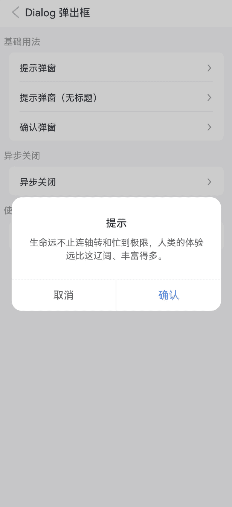
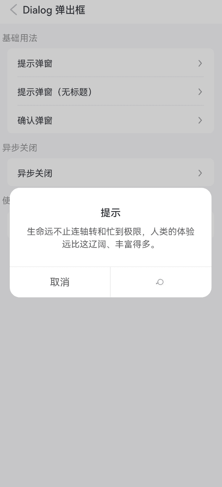

# Dialog 弹出框

## 介绍

弹出模态框，常用于消息提示、消息确认，或在当前页面内完成特定的交互操作。支持组件调用。

## 引入

```ts
import { IBestDialog } from "@ibestservices/ibest-ui";
```

## 代码演示

::: tip

- 本组件基于[自定义弹窗](https://developer.huawei.com/consumer/cn/doc/harmonyos-references-V2/ts-methods-custom-dialog-box-0000001477981237-V2)进行的封装，受鸿蒙限制，暂未找到函数调用的解决方案

:::

### 提示弹窗


::: tip

用于提示一些消息，默认只包含一个确认按钮。

:::

::: details 点我查看代码

```ts
import { IBestDialog, IBestButton } from '@ibestservices/ibest-ui'

@Entry
@Component
struct DialogPage {
  basicDialogController: CustomDialogController = null;

  build(){
    Column(){
      // 引入dialog组件
      IBestDialog({
        title: '提示',
        message: '代码是写出来给人看的，附带能在机器上运行。',
        onReady: controller => {
          this.basicDialogController = controller;
        },
      })

      IBestButton({
        text: '打开弹窗',
        type: 'primary',
        onClickBtn: () => {
          this.basicDialogController.open();
        }
      })
    }
  }
}
```

:::

### 提示弹窗（无标题）


::: tip

用于提示一些消息，默认只包含一个确认按钮。

:::

::: details 点我查看代码

```ts
import { IBestDialog, IBestButton } from '@ibestservices/ibest-ui'

@Entry
@Component
struct DialogPage {
  basicDialogController: CustomDialogController = null;

  build(){
    Column(){
      // 引入dialog组件
      IBestDialog({
        title: '',
        message: '代码是写出来给人看的，附带能在机器上运行。',
        onReady: controller => {
          this.basicDialogController = controller;
        },
      })

      IBestButton({
        text: '打开弹窗',
        type: 'primary',
        onClickBtn: () => {
          this.basicDialogController.open();
        }
      })
    }
  }
}
```

:::

### 确认弹窗


::: tip

用于确认消息，默认包含确认和取消按钮。

:::

::: details 点我查看代码

```ts
import { IBestDialog, IBestButton } from '@ibestservices/ibest-ui'

@Entry
@Component
struct DialogPage {
  basicDialogController: CustomDialogController = null;

  build(){
    Column(){
      // 引入dialog组件
      IBestDialog({
        title: '提示',
        message: '代码是写出来给人看的，附带能在机器上运行。',
        // 显示取消按钮
        showCancelButton: true,
        onReady: controller => {
          this.basicDialogController = controller;
        },
      })

      IBestButton({
        text: '打开弹窗',
        type: 'primary',
        onClickBtn: () => {
          this.basicDialogController.open();
        }
      })
    }
  }
}
```

:::

### 异步关闭


::: tip

通过 `beforeClose` 属性可以传入一个回调函数，在弹窗关闭前进行特定操作。

:::

::: details 点我查看代码

```ts
import { IBestDialog, IBestButton } from '@ibestservices/ibest-ui'

@Entry
@Component
struct DialogPage {
  basicDialogController: CustomDialogController = null;

  build(){
    Column(){
      // 引入dialog组件
      IBestDialog({
        title: '提示',
        message: '代码是写出来给人看的，附带能在机器上运行。',
        // 显示取消按钮
        showCancelButton: true,
        onReady: controller => {
          this.basicDialogController = controller;
        },
        beforeClose: (action) => {
          return new Promise((resolve) => {
            setTimeout(() => {
              resolve(action === 'confirm')
            }, 1000)
          })
        }
      })

      IBestButton({
        text: '打开弹窗',
        type: 'primary',
        onClickBtn: () => {
          this.basicDialogController.open();
        }
      })
    }
  }
}
```

:::

### 使用插槽


::: tip

通过 `defaultBuilder` 插槽可以自定义弹窗内容。

:::

::: details 点我查看代码

```ts
import { IBestDialog, IBestButton } from '@ibestservices/ibest-ui'

@Entry
@Component
struct DialogPage {
  /**
   * 输入框的值
   */
  @State inputValue: string = '';
  /**
   * 输入框的错误状态
   */
  @State formInputError: boolean = false;
  /**
   * 弹窗控制器
   */
  basicDialogController: CustomDialogController = null;

  /**
   * form输入框
   */
  @Builder
  FormInputContain() {
    Column() {
      TextInput({ 'placeholder': '请输入' })
        .fontSize('28lpx')
        .placeholderFont({ size: '28lpx' })
        .onChange((value) => {
          this.inputValue = value;
          this.formInputError = false
        })
      if (this.formInputError) {
        Text('不能为空')
          .width('100%')
          .textAlign(TextAlign.Start)
          .margin({
            top: SPACE.BASE,
            left: SPACE.MINI
          })
          .fontColor(Color.Red)
          .fontSize('24lpx')
          .transition({ type: TransitionType.Insert, opacity: 1 })
          .transition({ type: TransitionType.Delete, opacity: 0 })
      }

    }.width('90%').margin({ top: '30lpx', bottom: '30lpx' })
  }


  build(){
    Column(){
      // 引入dialog组件
      IBestDialog({
        title: '提示',
        // defaultbuidler插槽传入后需要自己编写弹窗体的内外边距
        defaultBuilder: this.FormInputContain.bind(this),
        // 显示取消按钮
        showCancelButton: true,
        onReady: controller => {
          this.basicDialogController = controller;
        },
        beforeClose: (action) => {
          if (action === 'cancel') {
            return true
          }
          const valueLength = this.inputValue.trim().length;
          this.formInputError = !valueLength;
          return !this.formInputError
        },
      })

      IBestButton({
        text: '打开弹窗',
        type: 'primary',
        onClickBtn: () => {
          this.basicDialogController.open();
        }
      })
    }
  }
}
```

:::

## API

### @Props

| 参数                  | 说明                                                           | 类型                          | 默认值                                                                                                          |
| --------------------- | -------------------------------------------------------------- | ----------------------------- | --------------------------------------------------------------------------------------------------------------- |
| dialogWidth           | 弹窗的宽度                                                     | _string_                      | `640lpx`                                                                                                        |
| dialogBorderRadius    | 弹窗的圆角                                                     | _string_                      | `32lpx`                                                                                                         |
| title                 | 弹窗的标题                                                     | _string_                      |                                                                                                                 |
| titleColor            | 弹窗的标题文字颜色                                             | _ResourceColor_ | <div style="padding: 2px 4px; background: #323233; color: #fff; border-radius: 4px">#323233</div>               |
| titlePaddingTop       | 弹窗的标题的 `padding-top` 值                                  | _string_                      | `52lpx`                                                                                                         |
| titlePaddingX         | 标题的 `padding-left` 与 `padding-right` 值                    | _string_                      | `48lpx`                                                                                                         |
| titleLienHeight       | 标题的 `line-height` 值                                        | _string_                      | `48lpx`                                                                                                         |
| titleFontSize         | 标题的 `font-size` 值                                          | _string_                      | `32lpx`                                                                                                         |
| titleTextAlign        | 标题的对齐方式                                                 | _left_ \| _center_ \| _right_ | `center`                                                                                                        |
| message               | 弹窗的内容区域文本                                             | _string_                      |                                                                                                                 |
| messagePaddingTop     | 弹窗的内容区域的 `padding-top` 值                              | _string_                      | `16lpx`                                                                                                         |
| messagePaddingX       | 弹窗的内容区域的 `padding-left` 与 `padding-right` 值          | _string_                      | `48lpx`                                                                                                         |
| messagePaddingXBottom | 弹窗的内容区域的 `padding-bottom` 值                           | _string_                      | `52lpx`                                                                                                         |
| messageFontColor      | 弹窗的内容区域的 `padding-bottom` 值                           | _string_                      | `52lpx`                                                                                                         |
| messageFontSize       | 弹窗的内容区域的 `font-size` 值                                | _string_                      | `28lpx`                                                                                                         |
| messageLineHeight     | 弹窗的内容区域的 `line-height` 值                              | _string_                      | `40lpx`                                                                                                         |
| messageTextAlign      | 弹窗的内容区域的文字对齐方式                                   | _left_ \| _center_ \| _right_ | `center`                                                                                                        |
| messageMaxHeight      | 弹窗的内容区域的滚动区域最大高度                               | _string_                      | `60%`                                                                                                           |
| showConfirmButton     | 是否展示确认按钮                                               | _boolean_                     | `true`                                                                                                          |
| showCancelButton      | 是否展示取消按钮                                               | _boolean_                     | `false`                                                                                                         |
| confirmButtonText     | 确认按钮文案                                                   | _string_                      | `确认`                                                                                                          |
| cancelButtonText      | 取消按钮的文案                                                 | _string_                      | `取消`                                                                                                          |
| confirmButtonColor    | 确认按钮的颜色                                                 | _ResourceColor_ | <div style="padding: 2px 4px; background: #3D8AF2; color: #fff; border-radius: 4px">#3D8AF2</div>               |
| cancelButtonColor     | 取消按钮的颜色                                                 | _ResourceColor_         | <div style="padding: 2px 4px; background: #646566; color: #fff; border-radius: 4px">#646566</div>               |
| confirmButtonDisabled | 是否禁用确认按钮                                               | _boolean_                     | `false`                                                                                                         |
| cancelButtonDisabled  | 是否禁用取消按钮                                               | _boolean_                     | `false`                                                                                                         |
| showOverlay           | 是否展示遮罩层，不展示的话则没有遮罩层 `API 10+`               | _boolean_                     | `true`                                                                                                          |
| overlayColor          | 遮罩层颜色 `API 10+`                                           | _ResourceColor_ | <div style="padding: 2px 4px; background: rgba(0, 0, 0, 0.2); color: #fff; border-radius: 4px">0x33000000</div> |
| showInSubWindow       | 某弹框需要显示在主窗口之外时，是否在子窗口显示此弹窗 `API 10+` | _boolean_                     | `false`                                                                                                         |

### Events

| 事件名      | 说明                                                          | 事件类型                                               |
| ----------- | ------------------------------------------------------------- | ------------------------------------------------------ |
| onReady     | 弹窗初始化的回调                                              | (dialogController: _CustomDialogController_) => _void_ |
| onConfirm   | 点击确认按钮的回调                                            | (event?: _ClickEvent_) => _void_                       |
| onCancel    | 点击取消按钮的回调                                            | (event?: _ClickEvent_) => _void_                       |
| beforeClose | 关闭前的回调函数，返回 `false` 可阻止关闭，支持返回 `Promise` | (event?: _ClickEvent_) => _void_                       |

### 插槽

| 插槽名         | 说明                                                                           | 类型                      |
| -------------- | ------------------------------------------------------------------------------ | ------------------------- |
| titleBuilder   | 标题的插槽，优先级大于 `title` 属性，将会完全接管 `title` 的渲染和间距控制     | _CustomBuilder_ \| _null_ |
| defaultBuilder | 内容的插槽，优先级大于 `message` 属性，将会完全接管 `message` 的渲染和间距控制 | _CustomBuilder_ \| _null_ |
| footerBuilder  | 底部的插槽，将会完全接管按钮不为的渲染和间距控制                               | _CustomBuilder_ \| _null_ |
