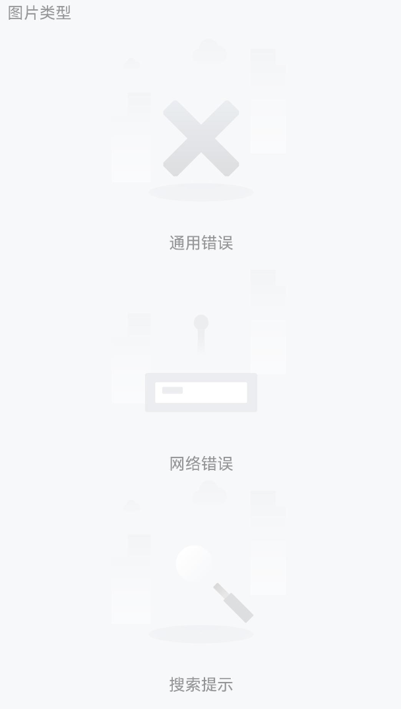
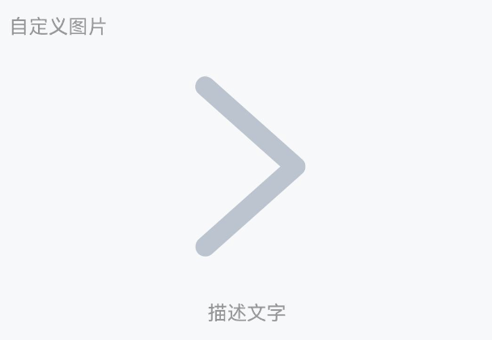
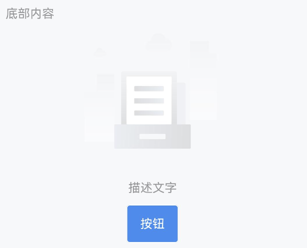

# Empty 空状态

## 介绍

空状态时的占位提示。

## 引入

```ts
import { IBestEmpty } from "@ibestservices/ibest-ui";
```

## 代码演示

### 基础用法


::: details 点我查看代码

```ts
IBestEmpty({
  description: "描述文字",
});
```

:::

### 图片类型



::: tip
Empty 组件内置了多种占位图片类型，可以在不同业务场景下使用。

:::

::: details 点我查看代码

```ts
// 通用错误
IBestEmpty({
  emptyImage: "error",
  description: "通用错误",
});

// 网络错误
IBestEmpty({
  emptyImage: "network",
  description: "网络错误",
});

// 搜索提示
IBestEmpty({
  emptyImage: "search",
  description: "搜索提示",
});
```

:::

### 自定义大小


::: tip
通过 `imageSize` 属性更改图片的大小。

:::

::: details 点我查看代码

```ts
IBestEmpty({
  imageSize: "200lpx",
  description: "描述文字",
});
```

:::

### 自定义图片



::: tip
需要自定义图片时，可以使用 `emptyImgBuilder` 插槽中传入任意内容。

:::

::: details 点我查看代码

```ts
import { IBestEmpty } from '@ibestservices/ibset-ui'

@Entry
@Component
struct EmptyPage {
  @Builder
  Arrow() {
    Image($r('app.media.title_back'))
    .height('320lpx')
  }

  build(){
    IBestEmpty({
      description: '描述文字',
      emptyImgBuilder: this.Arrow
    })
  }
}
```

:::

### 底部内容



::: tip
通过默认插槽 `defaultBuilder` 可以在 `Empty` 组件的下方插入内容。

:::

::: details 点我查看代码

```ts
import { IBestEmpty, IBestButton } from '@ibestservices/ibset-ui'

@Entry
@Component
struct EmptyPage {
  @Builder
  Btn() {
    IBestButton({ text: '按钮', type: 'primary' })
  }

  build(){
    IBestEmpty({
      description: '描述文字',
      defaultBuilder: this.Btn
    })
  }
}
```

:::

## API

### @Props

| 参数                | 说明                                      | 类型                 | 默认值                                                                                            |
| ------------------- | ----------------------------------------- | -------------------- | ------------------------------------------------------------------------------------------------- |
| emptyImage          | 类型，可选值为 `error` `network` `search` | _string_             | `default`                                                                                         |
| imageSize           | 图片大小                                  | _string_ \| _number_ | `320lpx`                                                                                          |
| description         | 图片下方的描述文字                        | _string_             |                                                                                                   |
| descriptionFontSize | 图片下方的描述文字的大小                  | _string_             | `28lpx`                                                                                           |
| descriptionColor    | 图片下方的描述文字的颜色                  | _string_             | <div style="padding: 2px 4px; background: #969799; color: #fff; border-radius: 4px">#969799</div> |

### @BuilderParam 插槽

| 插槽名             | 说明           | 类型                      |
| ------------------ | -------------- | ------------------------- |
| defaultBuilder     | 自定义底部内容 | _CustomBuilder_ \| _null_ |
| emptyImgBuilder    | 自定义图标     | _CustomBuilder_ \| _null_ |
| descriptionBuilder | 自定义描述文字 | _CustomBuilder_ \| _null_ |
