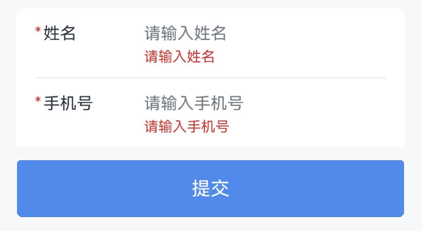
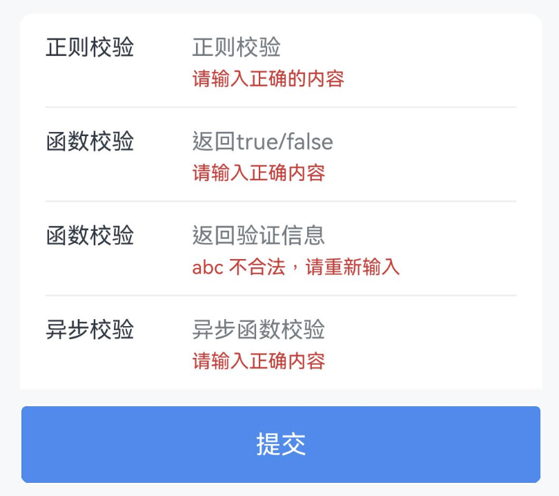
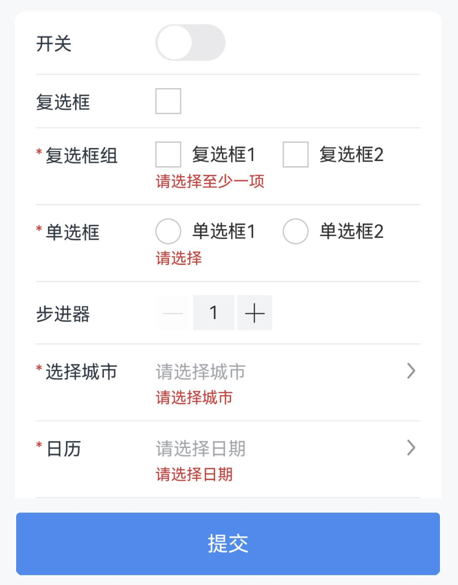

# Form 表单

## 介绍

用于数据录入、校验，支持输入框、单选框、复选框、文件上传等类型，需要与 Field 输入框 组件搭配使用。
 
## 引入

```ts
import { IBestForm, IBestFormRule, IBestField, IBestFormController } from "@ibestservices/ibest-ui";
```

## 代码演示

### 基础用法


:::tip
通过 `formId` 属性绑定表单与表单项的关系, `rules` 属性可配置表单校验规则，绑定 `controller` 属性可获取表单实例。   
• `formId` `controller` `props` 属性为必填项，未设置 `formId` `prop` 的表单项将不触发表单验证。
:::

::: details 点我查看代码
```ts
import { IBestCellGroup, IBestButton } from "@ibestservices/ibest-ui"
@Entry
@Component
struct DemoPage {
  @State name: string = ""
  @State phone: string = ""
  private formId: string = 'form'
  private controller: IBestFormController = new IBestFormController()
  build() {
    Column(){
      IBestForm({
        formId: this.formId,
        controller: this.controller
      }){
        IBestCellGroup({inset: true}) {
          IBestField({
            formId: this.formId,
            prop: 'name',
            value: $name,
            label: "姓名",
            placeholder: "请输入姓名",
            rules:[
              { required: true, message: '请输入姓名' },
              { min: 3, max: 10, message: '姓名长度在3-10个字符之间' }
            ]
          })
          IBestField({
            formId: this.formId,
            prop: 'phone',
            value: $phone,
            label: "手机号",
            placeholder: "请输入手机号",
            hasBorder: false,
            rules: [
              { required: true, message: '请输入手机号' }
            ]
          })
          IBestButton({
            text: "提交",
            type: 'primary',
            buttonSize: 'large',
            onClickBtn: () => {
              this.controller.validate((valid, fields) => {
                if (valid) {
                  IBestToast.show("验证成功")
                } else {
                  let names: string[] = fields.map(item => item.name)
                  console.log(`${names.join(',')}验证失败`)
                }
              })
            }
          })
            .margin({ top: 20 })
        }
      }
    }
  }
}
```
:::

### 校验规则


:::tip
通过 `rules` 定义表单校验规则，所有可用字段见下方表格
:::
::: details 点我查看代码
```ts
import { IBestCellGroup, IBestButton, IBestToast } from "@ibestservices/ibest-ui"
@Entry
@Component
struct DemoPage {
  @State value1: string = ""
  @State value2: string = ""
  @State value3: string = ""
  @State value4: string = ""
  private formId: string = 'form'
  // 正则校验
  private pattern = /\d{6}/
  // 校验函数返回 true 表示校验通过，false 表示不通过
  private validator = (val: string) => /1\d{10}/.test(val)
  // 校验函数可以直接返回一段错误提示
  private validatorMessage = (val: string) => `${val} 不合法，请重新输入`
  // 校验函数可以返回 Promise，实现异步校验
  private asyncValidator(val: string): Promise<boolean> {
    return new Promise((resolve) => {
      IBestToast.show({
        type: "loading",
        message: '校验中...'
      })
      setTimeout(() => {
        IBestToast.hide()
        resolve(val === '1234')
      }, 1000)
    })
  }
  private rules: IBestFormRule = {
    "value1": [
      { pattern: this.pattern, message: "请输入正确的内容" }
    ],
    "value2": [
      { validator: this.validator, message: "请输入正确内容" }
    ],
    "value3": [
      { validator: this.validatorMessage }
    ],
    "value4": [
      { validator: this.asyncValidator, message: "请输入正确内容" }
    ]
  }
  private controller: IBestFormController = new IBestFormController()
  build() {
    Column(){
      IBestForm({
        formId: this.formId,
        rules: this.rules,
        controller: this.controller
      }){
        IBestCellGroup({inset: true}) {
          IBestField({
            formId: this.formId,
            prop: 'value1',
            value: $value1,
            label: "正则校验",
            placeholder: "正则校验"
          })
          IBestField({
            formId: this.formId,
            prop: 'value2',
            value: $value2,
            label: "函数校验",
            placeholder: "返回true/false"
          })
          IBestField({
            formId: this.formId,
            prop: 'value3',
            value: $value3,
            label: "函数校验",
            placeholder: "返回验证信息"
          })
          IBestField({
            formId: this.formId,
            prop: 'value4',
            value: $value4,
            label: "异步校验",
            placeholder: "异步函数校验",
            hasBorder: false
          })
          IBestButton({
            text: "提交",
            type: 'primary',
            buttonSize: 'large',
            onClickBtn: () => {
              this.controller.validate((valid, fields) => {
                if (valid) {
                  console.log("验证成功")
                }
              })
            }
          })
            .margin({ top: 20 })
        }
      }
    }
  }
}
```
:::

### 自定义表单项类型


::: details 点我查看代码
```ts
import {
  CalendarConfirmResultType,
  IBestButton,
  IBestCalendarDialog,
  IBestCascader,
  IBestCascaderOption,
  IBestCellGroup,
  IBestCheckbox,
  IBestCheckboxGroup,
  IBestRadio,
  IBestRadioGroup,
  IBestStepper,
  IBestSwitch,
  IBestToast,
  IBestUploaderFile,
  IBestUploader
} from "@ibestservices/ibest-ui"
@Entry
@Component
struct DemoPage {
  @State value1: boolean = false
  @State value2: boolean = false
  @State value3: string[] = []
  @State value4: string = ""
  @State value5: number = 1
  @State value6: string = ""
  @State selectValue: string[] = []
  @State value7: string = ''
  @State visible: boolean = false
  @State visible1: boolean = false
  @State value8: IBestUploaderFile[] = []
  private formId: string = 'form'
  private rules: IBestFormRule = {
    "value3": [
      { required: true, message: '请选择至少一项' }
    ],
    "value4": [
      { required: true, message: "请选择" }
    ],
    "value6": [
      { required: true, message: "请选择城市" }
    ],
    "value7": [
      { required: true, message: "请选择日期" }
    ],
		"value12": [
			{ required: true, message: "请上传图片" }
		]
  }
  private controller: IBestFormController = new IBestFormController()
  @State options: IBestCascaderOption[] = [
    {
      text: "江苏省",
      value: "320000",
      children: [
        {
          text: "南京市",
          value: "320100",
          children: [
            {
              text: "秦淮区",
              value: "320104"
            },
            {
              text: "雨花台区",
              value: "320114"
            }
          ]
        },
        {
          text: "苏州市",
          value: "320500",
          children: [
            {
              text: "姑苏区",
              value: "320508"
            },
            {
              text: "昆山市",
              value: "320583"
            }
          ]
        }
      ]
    },
    {
      text: "安徽省",
      value: "340000",
      children: [
        {
          text: "合肥市",
          value: "340100",
          children: [
            {
              text: "蜀山区",
              value: "340104"
            },
            {
              text: "合肥高新技术产业开发区",
              value: "340171"
            }
          ]
        },
        {
          text: "黄山市",
          value: "341000",
          children: [
            {
              text: "屯溪区",
              value: "341002"
            },
            {
              text: "黄山区",
              value: "341003"
            }
          ]
        }
      ]
    }
  ]

  @Builder switchContent() {
    IBestSwitch({
      value: $value1
    })
  }
  @Builder checkboxContent() {
    IBestCheckbox({
      value: this.value2,
      shape: "square",
      name: "value2",
      onChange: value => {
        this.value2 = value
      }
    })
  }
  @Builder checkboxGroupContent() {
    IBestCheckboxGroup({
      group: "group1",
			activeList: $value3,
			placeDirection: Axis.Horizontal
    }){
      IBestCheckbox({
        group: "group1",
        shape: "square",
        label: "复选框1",
        name: "1"
      })
      IBestCheckbox({
        group: "group1",
        shape: "square",
        label: "复选框2",
        name: "2"
      })
    }
  }
  @Builder radioContent() {
    IBestRadioGroup({
      active: $value4,
      group: "group1",
      placeDirection: Axis.Horizontal
    }){
			IBestRadio({
				group: "group1",
				label: "单选框1",
				name: "1"
			})
			IBestRadio({
				group: "group1",
				label: "单选框2",
				name: "2"
			})
		}
  }
  @Builder stepperContent(){
    IBestStepper({
      value: $value5,
			min: 1,
			max: 99,
			step: 1
    })
  }
  @Builder uploadImg(){
		IBestUploader({
			fileList: $value12,
			max: 2
		})
	}
  build() {
    Column(){
      IBestForm({
        formId: this.formId,
        rules: this.rules,
        controller: this.controller
      }){
        IBestCellGroup({inset: true}) {
          IBestField({
            formId: this.formId,
            prop: 'value1',
            value: $value1,
            label: "开关",
            customRightContent: (): void => this.switchContent()
          })
          IBestField({
            formId: this.formId,
            prop: 'value2',
            value: $value2,
            label: "复选框",
            customRightContent: (): void => this.checkboxContent()
          })
          IBestField({
            formId: this.formId,
            prop: 'value3',
            value: $value3,
            label: "复选框组",
            customRightContent: (): void => this.checkboxGroupContent()
          })
          IBestField({
            formId: this.formId3,
            prop: 'value4',
            value: $value4,
            label: "单选框",
            customRightContent: (): void => this.radioContent()
          })
          IBestField({
            formId: this.formId,
            prop: 'value5',
            value: $value5,
            label: "步进器",
            customRightContent: (): void => this.stepperContent()
          })
          IBestField({
            formId: this.formId,
            prop: 'value6',
            value: this.value6,
            label: "选择城市",
            placeholder: "请选择城市",
            isLink: true,
            onFieldClick: () => {
              this.visible = true
            }
          })
          IBestField({
            formId: this.formId,
            prop: 'value7',
            value: this.value7,
            label: "日历",
            placeholder: "请选择日期",
            isLink: true,
            onFieldClick: () => {
              this.visible1 = true
            }
          })
          IBestField({
            formId: this.formId,
            prop: 'value8',
            value: $value8,
            label: "上传图片",
            hasBorder: false,
            customRightContent: (): void => this.uploadImg()
          })
          IBestButton({
            text: "提交",
            type: 'primary',
            buttonSize: 'large',
            onClickBtn: () => {
              this.controller.validate((valid, fields) => {
                if (valid) {
                  IBestToast.show("验证成功")
                }
              })
            }
          })
            .margin({ top: 20 })
        }
      }
      // 选择城市
      IBestCascader({
        visible: this.visible,
        options: this.options,
        value: $selectValue,
        onConfirm: (value: IBestCascaderOption[]) => {
          this.value6 = value.map(item => item.text).join(',')
        }
      })
      // 日历
      IBestCalendarDialog({
        visible: $visible1,
        onConfirm: (value: Array<CalendarConfirmResultType>): void => {
          this.value7 = value[0].dateStr
        }
      })
    }
  }
}
```
:::


## API

### @Props

| 参数         | 说明                                            | 类型      | 默认值     |
| ------------ | ----------------------------------------------| --------- | ---------- |
| formId       | 表单id, 必传                                   | _string_  | `''` |
| rules        | 表单验证信息                                    | _Record<string, IBestFormRuleItem[]>_  | `{}` |
| space        | 表单子项间距                                    | _number_ \| _string_  | `10`  |
| labelWidth   | 表单项左侧文本区域宽度                            | _number_ \| _string_ | `80`  |
| labelPosition | 左侧文本位置, 可选值 `left` `top`               | _string_ |`left`|
| labelAlign  | 左侧文本对齐方式, 可选值 `left` `center` `right`   | _string_ |`left`|
| colon       | 是否在label后加冒号                               | _boolean_ | `false` |
| requireAsteriskPosition| 星号的位置, 可选值 `left` `right`      | _string_ | `left` |
| showMessage | 是否显示验证信息                                  | _boolean_ | `true` |
| disabled    | 是否禁用                                         | _boolean_ | `false` |

### 插槽
|插槽名         | 说明                        | 类型                      |
| ------------ | -------------------------- | ------------------------- |
|defaultBuilder| 表单子项                     |  _CustomBuilder_  |

### API
::: tip
通过传入 `controller` 属性可调用组件实例方法
:::

| 方法名     |       说明                 | 参数                | 返回值   |
| --------- | ------------------------- | ---------------------- |-------|
| validate | 验证整个表单                 | `callback?: (valid: boolean, field: FieldValidateResult[]) => void` | `void` |
| validateField | 验证指定表单            | `prop: string, callBack?: (valid: boolean, field?: FieldValidateResult) => void` | `void` |
| resetValidation | 重置整个/指定表单验证信息| `prop?: string \| string[]` | `void` |
| getFormValues | 获取表单所有表单项的值    | `-` | `Record<string, IBestFieldValueType>` |

### IBestFormRuleItem  数据结构

| 参数 | 说明 | 类型 |
| ------------ | -------------------------------| --------- |
| required   | 是否为必选字段，当值为空值时（空字符串、空数组、false、undefined、null ），校验不通过 | _boolean_ |
| message    | 验证错误提示信息 | _string_ |
| pattern  | 正则表达式 | _RegExp_ |
| validator | 自定义校验函数 | _(value: string) => boolean \| string \| Promise<boolean \| string>_ |
| trigger | 验证触发时机, 默认都会触发 | _'blur' \| 'change'_ |
| min | 字符最小长度 | _number_ |
| max | 字符最大长度 | _number_ |