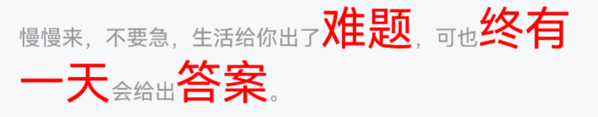

# Highlight 高亮文本

## 介绍

高亮指定文本内容。

## 引入

```ts
import { IBestHighlight } from "@ibestservices/ibest-ui";
```

## 代码演示

### 基础用法

你可以通过 `keywords` 指定需要高亮的关键字，通过 `sourceString` 指定源文本。


::: details 点我查看代码

```ts
IBestHighlight({
  keywords: '难题',
  sourceString: '慢慢来，不要急，生活给你出了难题，可也终有一天会给出答案。'
})
```

:::

### 多字符匹配


::: tip
如果需要指定多个关键字，可以以数组的形式传入 `keywords`。

:::

::: details 点我查看代码

```ts
IBestHighlight({
  keywords: ['难题', '终有一天', '答案'],
  sourceString: '慢慢来，不要急，生活给你出了难题，可也终有一天会给出答案。'
})
```

:::

### 设置高亮样式



::: tip
通过  `highColor` 和 `highFontSize` 可以设置高亮样式
:::

::: details 点我查看代码
```ts
IBestHighlight({
  keywords: ['难题', '终有一天', '答案'],
  sourceString: '慢慢来，不要急，生活给你出了难题，可也终有一天会给出答案。',
  highColor: Color.Red,
  highFontSize: 30
})
```
:::

### 设置默认样式


::: tip
通过  `textColor` 和 `textFontSize` 可以设置高亮样式

:::

::: details 点我查看代码
```ts
IBestHighlight({
  keywords: ['难题', '终有一天', '答案'],
  sourceString: '慢慢来，不要急，生活给你出了难题，可也终有一天会给出答案。',
  textColor: Color.Red,
  textFontSize: 16
})
```
:::

## API

### @Props

| 参数 | 说明 | 类型 | 默认值 |
| --- | --- | --- | --- |
| autoEscape | 是否自动转义 | _boolean_ | `true` |
| caseSensitive | 是否区分大小写 | _boolean_ | `false` |
| keywords        | 期望高亮的文本               | _string \| string[]_ | -         |
| sourceString    | 源文本                       | _string_             | -         |
| textColor | 文字颜色 | _ResourceColor_      | `#969799` |
| textFontSize | 文字大小 | _string_ | - |
| highColor       | 高亮文字颜色                 | _ResourceColor_      | `#1989fa` |
| highFontSize | 高亮文字大小 | _ResourceColor_      | `#1989fa` |
