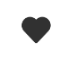

# Icon 图标

## 介绍

基于字体的图标集，可以通过 IBestIcon 组件使用。
 
## 引入

```ts
import { IBestIcon } from "@ibestservices/ibest-ui";
```

## 代码演示

### 基础用法



::: details 点我查看代码
```ts
@Entry
@Component
struct DemoPage {
  build() {
  Column(){
    IBestIcon({ name: 'like' })
  }
  }
}
```
:::

### 自定义颜色


::: details 点我查看代码
```ts
@Entry
@Component
struct DemoPage {
  build() {
    Row({space: 20}){
      IBestIcon({ name: 'cart-o', color: '#1989fa' })
      IBestIcon({ name: 'fire-o', color: '#ee0a24' })
    }
  }
}
```
:::

### 自定义大小


::: details 点我查看代码
```ts
@Entry
@Component
struct DemoPage {
  build() {
    Row({space: 20}){
      IBestIcon({ name: 'chat-o', iconSize: 20 })
      IBestIcon({ name: 'chat-o', iconSize: 40 })
    }
  }
}
```
:::


## API

### @Props

| 参数         | 说明                                         | 类型      | 默认值     |
| ------------| ---------------------------------------------| --------- | ---------- |
| name        | 图标名称或图标地址                              | _ResourceStr_  | `100%` |
| color       | 图标颜色                                       | _ResourceColor_ |  `''`  |
| iconSize    | 图标大小                                       | _string_ | - |

### Events

| 事件名     | 说明                                             | 事件类型                         |
| ---------- | ------------------------------------------------ | -------------------------------- |
| onIconClick | 点击图标时的回调函数                             | _() => void_ | - |