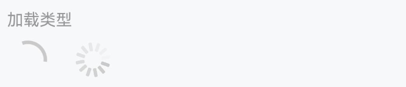
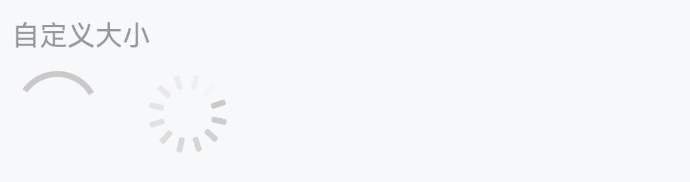
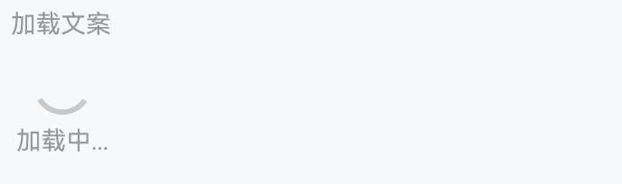
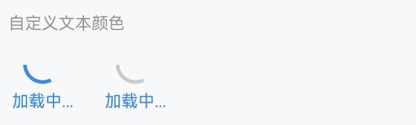

# Loading 加载

## 介绍

加载图标，用于表示加载中的过渡状态。

## 引入

```ts
import { IBestLoading } from "@ibestservices/ibest-ui";
```

## 代码演示

### 加载类型


::: tip
通过 `loadingIconType` 属性可以设置加载图标的类型，默认为 `circular`，可选值为 `spinner`。

:::

::: details 点我查看代码

```ts
IBestLoading();

IBestLoading({
  loadingIconType: "spinner",
});
```

:::

### 自定义颜色


::: tip
通过 `loadingColor` 属性设置加载图标的颜色。

:::

::: details 点我查看代码

```ts
IBestLoading({
  loadingColor: "rgb(25, 137, 250)",
});

IBestLoading({
  loadingColor: "rgb(25, 137, 250)",
  loadingIconType: "spinner",
});
```

:::

### 自定义大小


::: tip
通过 `loadingSize` 属性设置加载图标的大小，默认值为 `60px` 。

:::

::: details 点我查看代码

```ts
IBestLoading({
  loadingSize: "80lpx",
});

IBestLoading({
  loadingSize: "80lpx",
  loadingIconType: "spinner",
});
```

:::

### 加载文案


::: tip
可以使用 `loadingText` 属性在图标的下方插入加载文案。
:::

::: details 点我查看代码

```ts
IBestLoading({
  loadingText: "加载中...",
});
```

:::

### 水平排列


::: tip
设置 `vertical` 属性为 `false` 后，图标和文案会垂直排列。

:::

::: details 点我查看代码

```ts
IBestLoading({
  loadingText: "加载中...",
  vertical: false,
});
```

:::

### 自定义文本颜色


::: tip
通过 `loadingTextColor` 属性设置加载文案的颜色。
:::

::: details 点我查看代码

```ts
IBestLoading({
  loadingText: "加载中...",
  loadingColor: "rgb(25, 137, 250)",
  loadingTextColor: "rgb(25, 137, 250)",
});

IBestLoading({
  loadingText: "加载中...",
  loadingTextColor: "rgb(25, 137, 250)",
});
```

:::

### 包含内容


::: tip
通过 `defaultBuilder` 传入自定义内容
:::

::: details 点我查看代码

```ts
import { IBestLoading, IBestEmpty } from '@ibestservices/ibest-ui'

@Entry
@Component
struct LoadingPage {
  @Builder
  EmptyContain() {
    IBestEmpty()
  }

  build(){
    IBestLoading({
      defaultBuilder: this.EmptyContain,
      loadingMaskColor: 'rgba(0,0,0,0.5)',
      loadingColor: 'rgb(25, 137, 250)'
    })
  }
}

```

:::

## API

### @Props

| 参数                  | 说明                                                                                                                                                          | 类型                   | 默认值                                                                                            |
| --------------------- | ------------------------------------------------------------------------------------------------------------------------------------------------------------- | ---------------------- | ------------------------------------------------------------------------------------------------- |
| loadingIconType       | 类型，可选值为 `spinner`                                                                                                                                      | _string_               | `circular`                                                                                        |
| loadingText           | 加载的文案                                                                                                                                                    | _string_ \|_undefined_ |                                                                                                   |
| loadingSize           | 加载图标大小                                                                                                                                                  | _string_ \| _number_   | `60lpx`                                                                                           |
| loadingColor          | `loading` 的颜色                                                                                                                                              | _string_               | <div style="padding: 2px 4px; background: #c9c9c9; color: #fff; border-radius: 4px">#c9c9c9</div> |
| loadingTextColor      | `loading` 的文字颜色                                                                                                                                          | _string_               | <div style="padding: 2px 4px; background: #969799; color: #fff; border-radius: 4px">#969799</div> |
| loadingTextFontSize   | `loading` 的文字内容大小                                                                                                                                      | _string_               | `28lpx`                                                                                           |
| loadingStrokeWidth    | `loading` 图形的线条宽度                                                                                                                                      | _string_               | `6lpx`                                                                                            |
| loadingMaskColor      | `loading` 的遮罩颜色                                                                                                                                          | _string_               | `transparent`                                                                                     |
| loadingIconMarginTop  | `loading` 的图标距离顶部的 `margin` 因为默认 `loading` 是垂直居中布局的 可通过该属性调整`loading` 图标的上下位置 只有在 `vertical` 为 `true` 即垂直布局时有效 | _string_ \| _number_   | `0`                                                                                               |
| loadingTextMarginLeft | `loadingText` 的 `marginLeft` 值 只有在 `vertical` 为 `false` 即水平布局时有效                                                                                | _string_ \| _number_   | `16lpx`                                                                                           |
| loadingTextMarginTop  | `loadingText` 的 `marginTop` 值 只有在 `vertical` 为 `true` 即垂直布局时有效                                                                                  | _string_ \| _number_   | `16lpx`                                                                                           |
| spinnerStrokeHeight   | `spinner` 图的每条线的长度                                                                                                                                    | _string_ \| _number_   | `15lpx`                                                                                           |
| vertical              | 是否垂直排列图标和文字内容                                                                                                                                    | _boolean_              | `false`                                                                                           |

### @BuilderParam 插槽

| 插槽名             | 说明                     | 类型                      |
| ------------------ | ------------------------ | ------------------------- |
| defaultBuilder     | `loading` 包裹的组件插槽 | _CustomBuilder_ \| _null_ |
| loadingIconBuilder | `loading` 的图标插槽     | _CustomBuilder_ \| _null_ |
| loadingTextBuilder | `loading` 的文案插槽     | _CustomBuilder_ \| _null_ |
