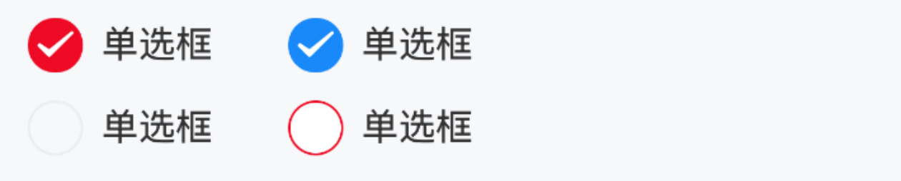

# Radio 单选框

## 介绍

在一组备选项中进行单选。

## 引入

```ts
import { IBestRadio, IBestRadioGroup } from "@ibestservices/ibest-ui";
```

## 代码演示

::: tip

- 通过 `IBestRadioGroup` 的 `onChange` 事件获取当前选中的 `radio` 的 `name` 。
- 通过 `group` 属性将 `IBestRadioGroup` 与 `IBestRadio` 组件关联起来， `group` 的值页面中具有**唯一性**。
- 通过 `IBestRadio` 组件的 `value` 来设置默认选中。
- `IBestRadio` 组件的 name 值需具备**唯一性**。

:::

### 基础用法


::: tip

- 通过 `IBestRadioGroup` 的 `onChange` 事件获取当前选中的 `radio` 的 `name` 。
- 通过 `IBestRadio` 组件的 `value` 来设置默认选中。

:::

::: details 点我查看代码

```ts
IBestRadioGroup({
  group: "group1",
  onChange: radioName => {
    console.log("choicedName", radioName);
  },
});

IBestRadio({
  value: true,
  label: "单选框1",
  name: "radio1",
  group: "group1",
});

IBestRadio({
  // 如果你多个同一 group 的 radio 都设置 value 为 true，
  // 那么 onchange 返回的将会是最后一个选中的 name
  // value: true,
  label: "单选框2",
  name: "radio2",
  group: "group1",
});
```

:::

### 水平排列


::: tip

给组件包裹一层 `Row` 组件，单选框组会变成水平排列。

:::

::: details 点我查看代码

```ts
Row() {
  IBestRadioGroup({ group: 'group3' })
  IBestRadio({
    value: true,
    label: '单选框1',
    name: 'radio2',
    group: 'group3'
  })

  IBestRadio({
    value: false,
    label: '单选框2',
    group: 'group3',
    name: 'checkbox3'
  })
}
```

:::

### 禁用状态


::: tip

在 `Radio` 上设置 `disabled` 可以禁用单个选项。

:::

::: details 点我查看代码

```ts
IBestRadioGroup({ group: "group2" });
IBestRadio({
  value: true,
  disabled: true,
  label: "单选框1",
  name: "radio2",
  group: "radio2",
});

IBestRadio({
  value: false,
  disabled: true,
  label: "单选框2",
  group: "group2",
  name: "radio3",
});
```

:::

### 自定义形状


::: tip

`shape` 属性可选值为 `square` 和 `dot`，单选框形状分别对应方形和圆点形。

:::

::: details 点我查看代码

```ts
IBestRadioGroup({ group: "group4" });
IBestRadio({
  value: true,
  shape: "square",
  group: "group4",
  label: "单选框1",
  name: "radio4",
});

IBestRadio({
  value: false,
  shape: "square",
  group: "group4",
  label: "单选框2",
  name: "radio5",
});

IBestRadioGroup({ group: "group5" });
IBestRadio({
  value: true,
  shape: "dot",
  group: "group5",
  label: "单选框3",
  name: "radio6",
});

IBestRadio({
  value: false,
  shape: "dot",
  group: "group5",
  label: "单选框4",
  name: "radio7",
});
```

:::

### 自定义颜色


::: tip

通过 `checkedColor` 属性设置选中状态的图标颜色。

:::

::: details 点我查看代码

```ts
IBestRadioGroup({ group: "group7" });

IBestRadio({
  group: "group7",
  checkedColor: "#ee0a24",
  shape: "square",
  label: "自定义颜色a",
  name: "radio5",
});

IBestRadio({
  group: "group7",
  checkedColor: "#ee0a24",
  label: "自定义颜色b",
  name: "radio6",
});

IBestRadio({
  value: true,
  group: "group7",
  shape: "dot",
  checkedColor: "#ee0a24",
  label: "自定义颜色c",
  name: "radio4",
});
```

:::

### 自定义大小


::: tip

通过 `iconSize` 属性可以自定义图标和文字的大小。

:::

::: details 点我查看代码

```ts
IBestRadioGroup({ group: "group8" });

IBestRadio({
  value: true,
  iconSize: 60,
  group: "group8",
  label: "自定义大小",
  name: "radio",
});

IBestRadio({
  iconSize: 60,
  group: "group8",
  label: "自定义大小",
  name: "radio2",
});
```

:::

### 左侧文本


::: tip

将 `labelPosition` 属性设置为 `'left'`，可以将文本位置调整到单选框左侧。

:::

::: details 点我查看代码

```ts
IBestRadioGroup({ group: "group9" });

IBestRadio({
  value: true,
  labelPosition: "left",
  group: "group9",
  label: "单选框1",
  name: "radio",
});

IBestRadio({
  group: "group9",
  labelPosition: "left",
  label: "单选框2",
  name: "radio2",
});
```

:::

### 禁用文本点击


::: tip
设置 `labelDisabled` 属性后，点击图标以外的内容不会触发单选框切换。
:::

::: details 点我查看代码

```ts
IBestRadioGroup({ group: "group10" });

IBestRadio({
  value: true,
  group: "group10",
  labelDisabled: true,
  label: "单选框1",
  name: "radio",
});

IBestRadio({
  group: "group10",
  labelDisabled: true,
  label: "单选框2",
  name: "radio2",
});
```

:::

### 搭配单元格组件使用


::: tip
搭配单元格组件使用时，需要再引入 `IBestCell` 和 `IBestCellGroup` 组件。
:::

::: details 点我查看代码

```ts
import { IBestCell, IBestRadio, IBestRadioGroup } from '@ibestservices/ibset-ui'

@Entry
@Component
struct CheckboxPage {
  @State slectedRadioName: string = '';

  @Builder
  CellRadio(name: string, group: string) {
    IBestRadio({
      name,
      group,
      value: name === this.slectedRadioName
    })
  }

  build(){
    IBestRadioGroup({ group: 'group12' })

    IBestCell({
      title: '单选框1',
      rightIconBuilder: () => this.CellRadio('radio1', 'group12'),
      clickable: true,
      onClickCell: () => {
        this.slectedRadioName = 'radio1'
      }
    })

    IBestCell({
      title: '单选框2',
      rightIconBuilder: () => this.CellRadio('radio2', 'group12'),
      hasBorder: false,
      clickable: true,
      onClickCell: () => {
        this.slectedRadioName = 'radio2'
      }
    })
  }
}
```

:::
