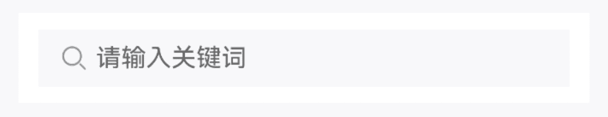
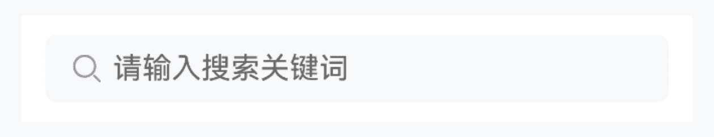
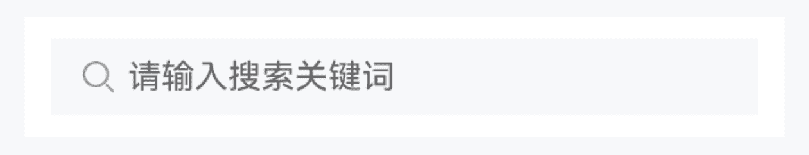
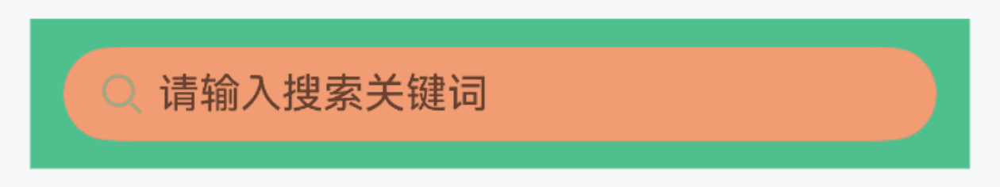
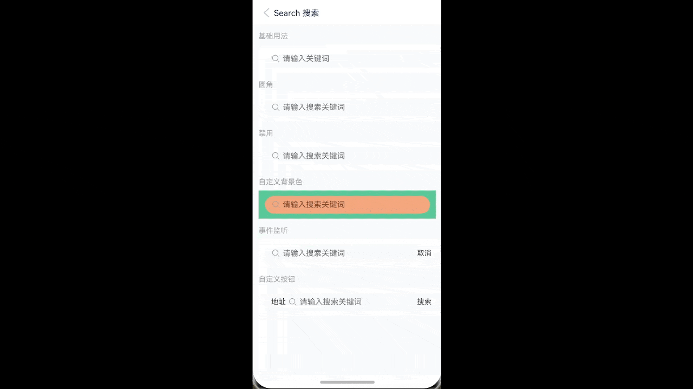
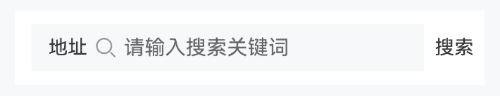

# Search 搜索

## 介绍

用于搜索场景的输入框组件。
 
## 引入

```ts
import { IBestSearch } from "@ibestservices/ibest-ui";
```
 
## 代码演示

### 基础用法


:::tip
通过 `autoFocus` 属性，可以设置搜索框自动获取焦点。
:::

::: details 点我查看代码
```ts
@Entry
@Component
struct DemoPage {
  @State value: string = ""
  build() {
    Column(){
      IBestSearch({
        value: $value,
        placeholder: "请输入关键词",
        autoFocus: true
      })
    }
  }
}
```
:::

### 圆角



::: details 点我查看代码
```ts
@Entry
@Component
struct DemoPage {
  @State value: string = ""
  build() {
    Column(){
      IBestSearch({
        value: $value,
        radius: 12
      })
    }
  }
}
```
:::

### 禁用



::: details 点我查看代码
```ts
@Entry
@Component
struct DemoPage {
  @State value: string = ""
  build() {
    Column(){
      IBestSearch({
        value: $value,
        disabled: true
      })
    }
  }
}
```
:::

### 自定义样式



::: details 点我查看代码
```ts
@Entry
@Component
struct DemoPage {
  @State value: string = ""
  build() {
    Column(){
      IBestSearch({
        value: $value,
        isRound: true,
        outBgColor: "#4fc08d",
        innerBgColor: "#F29C73"
      })
    }
  }
}
```
:::

### 事件监听



::: details 点我查看代码
```ts
import { IBestToast } from "@ibestservices/ibest-ui";
@Entry
@Component
struct DemoPage {
  @State value: string = ""
  build() {
    Column(){
      IBestSearch({
        value: $value,
        showRightButton: true,
        clearable: true,
        onRightButtonClick: () => {
          IBestToast.show("rightIconClick")
        },
        onClear: () => {
          IBestToast.show("clear")
        },
        onSearch: () => {
          IBestToast.show(`search: ${this.value}`)
        },
        onInput: (value: string) => {
          console.log(`输入的值为: ${value}`)
        }
      })
    }
  }
}
```
:::

### 自定义按钮


:::tip
通过 `label` 属性可设置左侧文本, 通过 `rightButtonText` 属性可设置右侧按钮文本。
:::

::: details 点我查看代码
```ts
@Entry
@Component
struct DemoPage {
  @State value: string = ""
  build() {
    Column(){
      IBestSearch({
        value: $value,
        label: "地址",
        showRightButton: true,
        rightButtonText: "搜索"
      })
    }
  }
}
```
:::


## API

### @Props

| 参数         | 说明                                          | 类型      | 默认值     |
| ------------ | ---------------------------------------------| --------- | ---------- |
| value        | 当前输入的值, 支持双向绑定                       | _string_  | `''` |
| label        | 输入框左侧文本                                  | _string_  | `''` |
| placeholder  | 占位文字                                       | _string_  | `请输入搜索关键词` |
| placeholderColor  | 占位文字颜色                               | _string_  | `#c8c9cc` |
| contentHeight| 搜索框高度,单位lpx                              | _number_ | `108` |
| outBgColor   | 外侧背景色                                     | _string_ | `#fff` |
| innerBgColor | 内侧背景色                                     | _string_ | `#f7f8fa` |
| isRound      | 是否为胶囊搜索框                                | _boolean_ |  `false`  |
| radius       | 圆角大小, 优先级大于isRound, 单位lpx             | _number_ | `0` |
| leftIcon     | 左侧图标                                       | _string \| Resource_ | `-` |
| leftIconColor| 左侧图标颜色                                    | _string_ |  `#969799`  |
| clearable    | 是否可清空                                      | _boolean_ |  `true`  |
| clearIcon    | 清除图标                                        | _string \| Resource_ |  `-`  |
| clearTrigger | 清除图标显示时机, 可选值 `always` `focus`          | _string_ |  `focus`  |
| autoFocus    | 是否自定聚焦                                     | _boolean_ |  `false`  |
| showRightButton| 是否显示右侧按钮                                | _boolean_ |  `false`  |
| rightButtonText| 右侧按钮文本                                    | _string_ |  `取消`  |
| disabled     | 是否禁用                                         | _boolean_ |  `false`  |
| readOnly     | 是否只读                                         | _boolean_ |  `false`  |
| enterKeyType | 输入法回车键类型, 详见<a href="https://developer.huawei.com/consumer/cn/doc/harmonyos-references-V5/ts-types-V5#enterkeytype%E6%9E%9A%E4%B8%BE%E8%AF%B4%E6%98%8E" target="__blank">EnterKeyType枚举说明</a> | _EnterKeyType_ |  `Search`  |


### Events

| 事件名     | 说明         | 回调参数             |
| ----------| ------------------------------ | -------------------------------- |
| onInput   | 输入时触发 | `value: string` |
| onSearch  | 点击输入法右下角按钮触发 | `-` |
| onInputBlur| 搜索框失焦时触发 | `-` |
| onInputFocus  | 搜索框聚焦时触发 | `-` |
| onClear  | 点击清除图标时触发 | `-` |
| onRightButtonClick  | 点击右侧按钮时触发 | `-` |