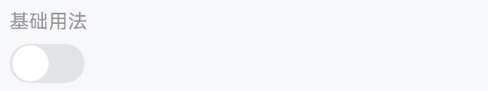
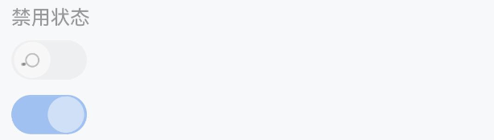
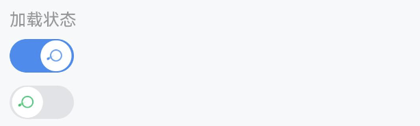
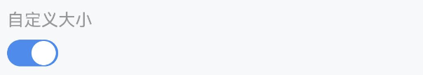
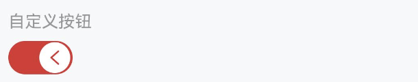
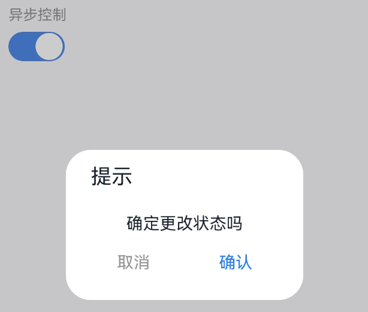

# Switch 开关

## 介绍

用于在打开和关闭状态之间进行切换。

## 引入

```ts
import { IBestSwitch } from "ibest-ui";
```

## 代码演示

### 基础用法


::: tip

通过 `IBestSwitch` 组件的 `value` 来设置开关的状态，通过 `onChange` 监听状态变化。

:::

::: details 点我查看代码

```ts
IBestSwitch({
  value: true,
  onChange: value => {
    console.log("switch", value);
  },
});
```

:::

### 禁用状态


::: tip

通过 `disabled` 属性来禁用开关，禁用状态下开关不可点击。

:::

::: details 点我查看代码

```ts
IBestSwitch({
  loading: true,
  disabled: true,
});

IBestSwitch({
  disabled: true,
  value: true,
});
```

:::

### 加载状态


::: tip

通过 `loading` 属性来禁用开关，加载状态下开关不可点击。

:::

::: details 点我查看代码

```ts
IBestSwitch({
  loading: true,
  value: true,
});

IBestSwitch({
  loading: true,
  activeColor: "#07c160",
});
```

:::

### 自定义大小


::: tip

通过 `switchSize` 属性自定义开关的大小。

:::

::: details 点我查看代码

```ts
IBestSwitch({
  value: true,
  switchSize: 40,
});
```

:::

### 自定义按钮


::: tip

通过 `nodeBuilder` 插槽自定义按钮的内容。

:::

::: details 点我查看代码

```ts
import { IBestSwitch } from '@ibestservices/ibset-ui'

@Entry
@Component
struct SwitchPage {
  @State arrowDirection: 'left' | 'right' = 'left';

  @Builder Arrow(){
    Row(){
      Image($r('app.media.arrow'))
        .width('30lpx')
        .fillColor(this.arrowDirection === 'left' ? '#db3131' : '#e2e3e7')
        .rotate({
          angle: this.arrowDirection === 'left' ? 0 : -180
        }).animation({
        duration: 200,
      })
    }
  }

  build(){
    IBestSwitch({
      value: true,
      activeColor: '#db3131',
      nodeBuilder: () => this.Arrow(),
      onChange: (value) => {
        this.arrowDirection = value ? 'left' : 'right';
      }
    })
  }
}

```

:::

### 异步控制


::: tip

当需要异步控制开关状态时，可以在 `onBeforeChange` 事件的回调函数中返回一个 `Promise` 。如果 `Promise` 状态为 `resolve` ，则按钮状态变化将继续进行；如果状态为 `reject` ，则将阻止按钮状态的变化。

:::

::: details 点我查看代码

```ts
IBestSwitch({
  value: true,
  onBeforeChange: () => {
    return new Promise((resolve, reject) => {
      AlertDialog.show({
        title: "提示",
        message: "确定更改状态吗",
        autoCancel: true,
        alignment: DialogAlignment.Bottom,
        offset: { dx: 0, dy: -20 },
        gridCount: 3,
        primaryButton: {
          value: "取消",
          action: () => {
            reject("");
          },
        },
        secondaryButton: {
          value: "确认",
          action: () => {
            resolve("");
          },
        },
        cancel: () => {
          reject("");
        },
      });
    });
  },
});
```

:::

## API

### @Props

| 参数                 | 说明                                                                  | 类型                 | 默认值                                                                                                                                |
| -------------------- | --------------------------------------------------------------------- | -------------------- | ------------------------------------------------------------------------------------------------------------------------------------- |
| value                | 默认是否选中 非双向绑定，如果要获取最新的值请从 `onChange` 回调中获取 | _string_ \| _number_ |                                                                                                                                       |
| disabled             | 是否禁用按钮                                                          | _boolean_            | `false`                                                                                                                               |
| loading              | 是否显示为加载状态                                                    | _boolean_            | `false`                                                                                                                               |
| switchSize           | 大小尺寸，单位 `lpx`，                                                | _number_             | 52                                                                                                                                    |
| activeColor          | 打开时的背景色                                                        | _string_             | <div style="padding: 2px 4px; background: #1989fa; color: #fff; border-radius: 4px">#1989fa</div>                                     |
| inactiveColor        | 关闭时的背景色                                                        | _string_             | <div style="padding: 2px 4px; background: rgba(120, 120, 128, 0.16); color: #fff; border-radius: 4px">rgba(120, 120, 128, 0.16)</div> |
| loadingActiveColor   | 打开时的 loading 颜色，默认跟随 `activeColor`                         | _string_             |                                                                                                                                       |
| loadingInactiveColor | 关闭时的 loading 颜色，默认跟随 `activeColor`                         | _string_             |                                                                                                                                       |

### Events

| 事件名         | 说明                                                                                                                                                          | 事件类型                               |
| -------------- | ------------------------------------------------------------------------------------------------------------------------------------------------------------- | -------------------------------------- |
| onChange       | 开关状态改变的回调事件                                                                                                                                        | (value: _boolean_) => _void_           |
| onBeforeChange | 开关状态改变前的回调事件，接收一个 `Promise` 对象，如果 `Promise` 状态为 `resolve` ，则按钮状态变化将继续进行；如果状态为 `reject` ，则将阻止按钮状态的变化。 | (value: _boolean_) => _Promise\<any\>_ |
| onClickSwitch  | 点击开关的回调事件                                                                                                                                            | (event: _ClickEvent_)_ => \_void_      |

### @BuilderParam 插槽

| 插槽名      | 说明             | 类型                      |
| ----------- | ---------------- | ------------------------- |
| nodeBuilder | 自定义按钮的内容 | _CustomBuilder_ \| _null_ |
