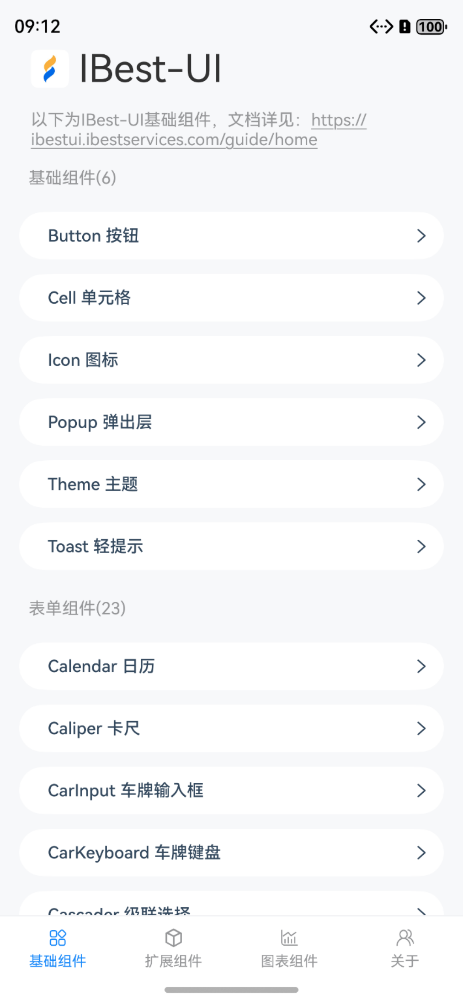

# {{ $frontmatter.title }}

## 介绍

{{ $frontmatter.title }} 是一个轻量、简单易用、可定制主题、支持深色模式和浅色模式的鸿蒙开源UI组件库。

  
  

## 快速上手

请阅读[快速上手](../quickstart/index)章节，通过该章节你可以了解到 {{ $frontmatter.title }} 的安装方法和基本使用姿势。

## 贡献指南

贡献代码请阅读我们的[贡献指南](../contribution/)。

使用过程中发现任何问题都可以提 [issue](https://github.com/ibestservices/ibest-ui/issues) 给我们，当然，我们也非常欢迎你给我们发 [PR](https://github.com/ibestservices/ibest-ui/pulls)。

## 开源协议

本项目基于 `Apache2.0` 协议，请自由地享受和参与开源。

## 特别感谢

[vant](https://vant-contrib.gitee.io/vant/#/zh-CN/home)

## 贡献者

感谢以下同学对 `IBest-UI` 做的贡献:

## QQ 群

群号： 953492584

## 微信群

先进QQ群, 群里有微信群二维码